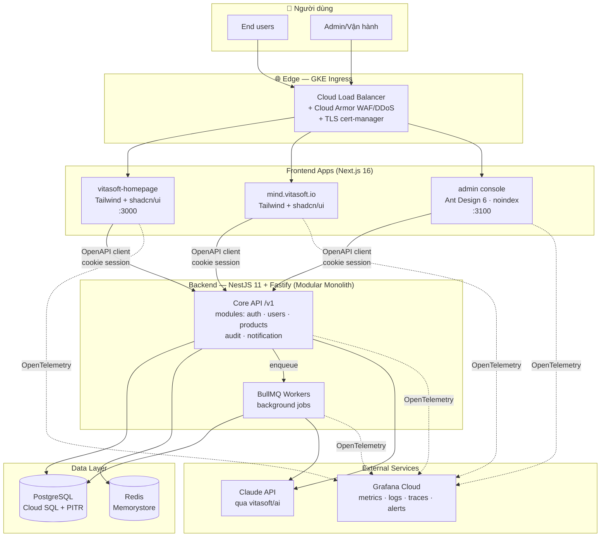
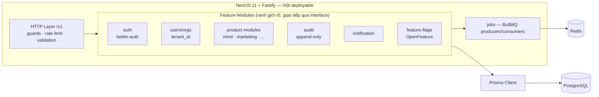
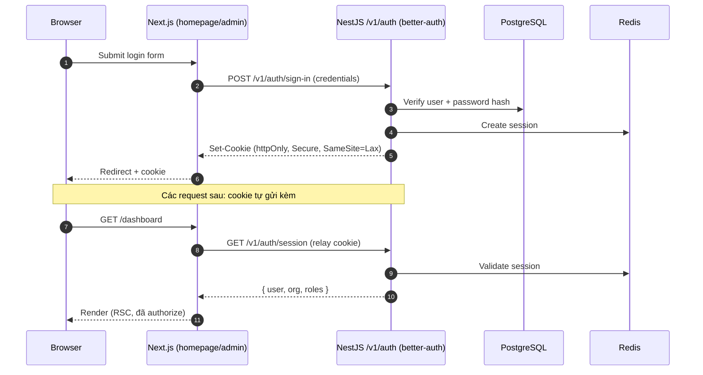
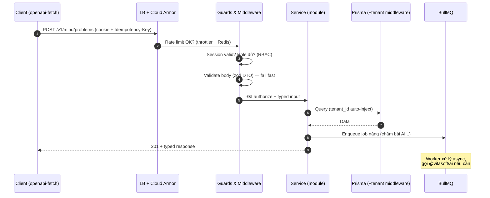
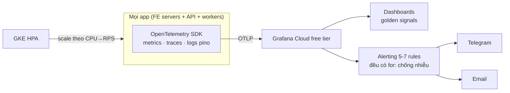
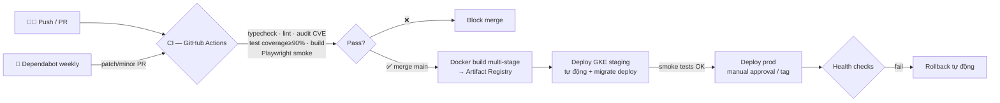

# Vitasoft — Architecture Design

> **Phiên bản:** 2.0 — 2026-07-06
> **Trạng thái:** Đã chốt qua deep research ([backend](research/2026-07-06-backend-framework-core.md) · [feature set](research/2026-07-06-core-backend-features.md) · [frontend](research/2026-07-06-frontend-framework-homepage.md))
> Mọi thay đổi kiến trúc lớn phải qua quy trình deep-research và cập nhật tài liệu này.

## 1. Tổng quan hệ thống

Vitasoft là **AI-powered software studio**: một nền tảng core dùng chung, trên đó nhiều
ý tưởng sản phẩm (Mind, marketing tools, ideas mới) được triển khai nhanh với chi phí biên thấp.



## 2. Nguyên tắc kiến trúc

| # | Nguyên tắc | Hệ quả thực tế |
|---|---|---|
| 1 | **Modular monolith trước, microservices sau** | Một NestJS app, module tách rời qua interface; chỉ tách service khi có bằng chứng scale |
| 2 | **Core dùng chung, sản phẩm mỏng** | Auth, DB, observability, jobs nằm ở `core/` — sản phẩm mới chỉ viết business logic |
| 3 | **Không dependency EOL** | Chỉ Active LTS (Node 24); Dependabot auto-fix; gate trong CI |
| 4 | **Managed trước self-host** | Cloud SQL, Memorystore, Grafana Cloud — team nhỏ không vận hành hạ tầng stateful |
| 5 | **AI qua một cổng duy nhất** | Mọi gọi Claude đi qua `@vitasoft/ai` — đổi model/caching một chỗ |
| 6 | **Quality gates là luật** | Coverage ≥90%, Playwright E2E, lint, audit CVE — CI fail là dừng |

## 3. Tech Stack (đã chốt)

| Layer | Công nghệ | Căn cứ |
|---|---|---|
| Frontend sản phẩm | Next.js 16 (App Router/RSC) + Tailwind 4 + shadcn/ui + next-intl | [research frontend](research/2026-07-06-frontend-framework-homepage.md) — 207/220 |
| Admin console | Next.js 16 + Ant Design 6 | Quyết định founder — bộ Table/Form data-heavy |
| Backend | NestJS 11 + Fastify adapter, ESM-first | [research backend](research/2026-07-06-backend-framework-core.md) — 154/180 |
| AuthN | better-auth (self-host, org/multi-tenant) | [research features](research/2026-07-06-core-backend-features.md) §1 |
| AuthZ | RBAC (nâng ReBAC/OpenFGA khi cần) | research features §1 |
| ORM/DB | Prisma + PostgreSQL (Cloud SQL PITR) | research features §5 |
| Cache/Queue | Redis (Memorystore) + BullMQ | research features §5 |
| API contract | OpenAPI (NestJS Swagger) → openapi-typescript/openapi-fetch | research frontend §4 |
| Feature flags | OpenFeature + GrowthBook | research features §2 |
| Observability | OpenTelemetry → Grafana Cloud (free tier) | research features §3 |
| Testing | Vitest (coverage ≥90%) + Playwright E2E | quality-standards §3-4 |
| Runtime | Node 24 (Active LTS) · pnpm 9 · Turborepo | quality-standards §1 |
| Deploy | GKE + Docker multi-stage · GitHub Actions | mục 10 dưới |

## 4. Kiến trúc Frontend

### 4.1 Hai hệ UI — không trộn lẫn

| App | UI | Lý do |
|---|---|---|
| homepage, mind, marketing | Tailwind 4 + shadcn/ui | Kiểm soát design, SEO, bundle nhỏ |
| admin (và chỉ admin) | Ant Design 6 | Table/Form phức tạp có sẵn cho back-office |

### 4.2 Chiến lược render & SEO (frontend sản phẩm)

- **RSC mặc định** — component chỉ thành `"use client"` khi cần tương tác. Ship ít JS = CWV tốt.
- **SSG/ISR** cho trang marketing/landing; SSR cho trang cá nhân hoá.
- SEO: Metadata API + `sitemap.ts` + `robots.ts` + JSON-LD structured data.
- **i18n (vi/en):** next-intl — locale routing `/{locale}/...`, hreflang tự động, message
  catalog theo namespace.
- **Responsive, không adaptive:** một codebase, fluid grid + container queries, mobile → 4K.
  Không device-detection theo User-Agent (phá SEO + CDN cache).

### 4.3 Giao tiếp với backend

```
NestJS Swagger (OpenAPI spec) ──generate──▶ openapi-typescript (types)
                                            openapi-fetch (client)
```

- Type sinh tự động từ spec — FE/BE không bao giờ lệch shape; regenerate trong CI khi spec đổi.
- Auth qua **cookie session relay**: Next server component đọc cookie, validate với backend;
  không lưu token trong localStorage.

### 4.4 Self-host Next.js trên GKE (checklist một lần)

- ISR/data cache đa pod: custom `cacheHandler` dùng Redis.
- Set `NEXT_SERVER_ACTIONS_ENCRYPTION_KEY` + `deploymentId` thống nhất giữa các pod.
- `sharp` build đúng target Linux glibc trong Docker.
- CDN (Cloud CDN) trước static assets `_next/static`.

## 5. Kiến trúc Backend — Modular Monolith



### 5.1 Packages `core/` (thư viện dùng chung)

| Package | Phạm vi | Phase |
|---|---|---|
| `@vitasoft/config` ✅ | Env validation (zod), fail-fast | Có sẵn |
| `@vitasoft/logger` ✅ | Structured JSON (pino), traceId correlation | Có sẵn |
| `@vitasoft/ai` ✅ | Claude client — models, streaming, tool use | Có sẵn |
| `@vitasoft/auth` | better-auth setup, guards, RBAC decorators | Ngay |
| `@vitasoft/database` | Prisma client, tenant middleware, migration helpers | Ngay |
| `@vitasoft/observability` | OTel SDK setup, metrics, health indicators | Ngay |
| `@vitasoft/http-kit` | Filters, interceptors, idempotency, API versioning | Ngay |
| `@vitasoft/jobs` | BullMQ wrappers, queue conventions | Khi có user |
| `@vitasoft/audit` | Audit log append-only | Khi có user |
| `@vitasoft/feature-flags` | OpenFeature + GrowthBook provider | Khi có user |
| `@vitasoft/notification` | Email/Telegram templates | Khi có user |
| `@vitasoft/crypto` | Field-level KMS envelope encryption | Khi cần |

### 5.2 Multi-tenancy

- Shared database + cột `tenant_id` (organization) trên mọi bảng nghiệp vụ.
- Prisma middleware tự inject filter `tenant_id` — quên filter là lỗi không thể xảy ra
  thay vì lỗi phải nhớ.
- Nâng cấp: PostgreSQL Row-Level Security khi có khách hàng enterprise.

## 6. Authentication & Authorization

### 6.1 Luồng đăng nhập (better-auth, cookie session)



- Cookie `httpOnly + Secure + SameSite` — không token trong localStorage (chống XSS token theft).
- **RBAC:** roles gắn theo organization (`admin`, `operator`, `member`); NestJS guards +
  decorators `@Roles()`. Admin console yêu cầu role `admin`.
- **Service-to-service:** JWT client-credentials hoặc API key hashed — không dùng session cookie.
- **E2E encryption — lập trường trung thực:** backend cần đọc dữ liệu để xử lý nghiệp vụ nên
  E2E thuần (server mù dữ liệu) không áp dụng cho API chung. Bảo vệ đúng tầng:
  TLS 1.3 mọi kết nối (in-transit) + mã hoá at-rest (managed) + **field-level KMS envelope
  encryption** cho cột nhạy cảm (PII, tokens bên thứ ba). mTLS nội bộ: chưa cần ở quy mô
  hiện tại, bật khi tách service.

### 6.2 Luồng API request (sau khi đã đăng nhập)



Chuẩn API: version qua URI `/v1` · idempotency key (Redis) cho POST quan trọng ·
error format thống nhất (RFC 7807 problem+json) · pagination cursor-based.

## 7. Bảo mật — phòng thủ theo lớp

| Lớp | Biện pháp | Trạng thái |
|---|---|---|
| Edge | Cloud Armor (WAF, DDoS, rate limit IP), TLS 1.3, cert-manager | Phase 2 infra |
| Transport | HTTPS mọi nơi; HSTS; internal traffic trong VPC | Phase 2 |
| App | zod validation mọi boundary; throttler per-route; secure headers (CSP, HSTS); CSRF-safe cookie | Cùng code |
| AuthN/Z | better-auth (thư viện audit sẵn), RBAC guards, session Redis revoke được | Cùng code |
| Data | At-rest encryption (managed); field-level KMS cho PII; audit log append-only | Cùng code / khi cần |
| Supply chain | `pnpm audit` gate CI (high/critical fail); Dependabot weekly + auto-merge patch/minor | ✅ Đang chạy |
| Secrets | Local: `.env` gitignored · Prod: Google Secret Manager + KMS; không bao giờ trong repo/log | ✅ Quy ước |
| AI | Output của Claude là untrusted input — validate trước khi dùng làm query/command | ✅ Quy ước |

OWASP Top 10 checklist chạy trong QA gate cho mọi tính năng có input người dùng.

## 8. Observability & Alerting



**Đo từ ngày 1 (4 golden signals):** latency p50/p95/p99 · traffic RPS · error rate ·
saturation (CPU/mem/connections). Logs JSON có `traceId` — click từ log sang trace.

**Health checks** (`@nestjs/terminus`): `/health/live` (process sống) và `/health/ready`
(DB + Redis kết nối được) — GKE dùng cho liveness/readiness probes và rolling deploy.

**Alert rules khởi điểm (5–7, tránh fatigue):** error rate >5% (5m) · p99 >1s (5m) ·
pod restart loop · DB connections >90% · queue depth tăng bất thường · certificate sắp hết hạn.

## 9. Data Layer

- **PostgreSQL (Cloud SQL):** nguồn sự thật; PITR backup managed; restore drill mỗi quý.
- **Redis (Memorystore):** session store · BullMQ queues · rate limit counters ·
  idempotency keys · Next.js ISR cacheHandler.
- **Migration an toàn (expand-contract):** thêm cột/bảng mới (expand) → deploy code dùng cả hai
  → backfill → gỡ cũ (contract). `prisma migrate deploy` chạy từ CD pipeline, không bao giờ
  `migrate dev` trên prod. Không có migration phá huỷ trong một bước.

## 10. CI/CD & Môi trường



| Môi trường | Trigger | Ghi chú |
|---|---|---|
| Local | `docker compose up` | Toàn hệ trên Docker Desktop: apps + Postgres + Redis; cùng Dockerfile với prod |
| Staging | Merge `main` | Namespace `vitasoft-staging`, auto migrate + smoke test |
| Production | Manual approval / release tag | Namespace `vitasoft-prod`, rolling update, rollback theo health check |

**MCP cho vận hành:** `.mcp.json` cấu hình GitHub MCP (PR/issues), database MCP (inspect local),
Grafana MCP (Phase 4) — thao tác lặp lại qua UI ≥3 lần/tuần thì tìm MCP server cho nó.

## 11. AI Layer

- **Một cổng:** `@vitasoft/ai` — model IDs chuẩn hoá (Opus 4.8 mặc định · Haiku 4.5 cho
  classification rẻ · Fable 5 cho reasoning khó nhất), adaptive thinking, streaming, tool use.
- Backend gọi AI trong **BullMQ worker** cho tác vụ dài (chấm bài, sinh content) — API request
  không bao giờ block chờ LLM lâu; kết quả đẩy về qua polling/SSE.
- Prompt caching cho system prompt lớn (giảm ~90% chi phí input lặp).
- AI output = untrusted input (xem §7).

## 12. Quality Gates (tóm tắt thực thi)

| Gate | Ngưỡng | Thực thi ở |
|---|---|---|
| Dependency lifecycle | Không EOL, Node Active LTS only | Review + Dependabot + endoflife.date check |
| Coverage | ≥90% lines/functions mỗi module | Vitest thresholds — CI fail |
| E2E | Playwright smoke mỗi PR, full nightly | CI |
| Security | 0 CVE high/critical · OWASP checklist | `pnpm audit` CI + QA gate |
| Convention | TSDoc export public core/ · naming · lint sạch | ESLint/Prettier CI + QA review |
| Principles | SRP, fail-fast, immutability, KISS>DRY>YAGNI | QA review — vi phạm = finding |

## 13. Roadmap

| Phase | Nội dung | Trạng thái |
|---|---|---|
| 1 | Monorepo foundation, core packages (config/logger/ai), homepage + admin skeleton, CI, harness | ✅ Done |
| 1.5 | Research stack (backend/features/frontend) + quality gates | ✅ Done |
| 2a | Build core backend: NestJS app + @vitasoft/auth · database · observability · http-kit; nâng homepage Next 16; docker compose local | ⬜ Next |
| 2b | Infra: Terraform GKE + Secret Manager + CD staging | ⬜ |
| 3 | Mind MVP (FE + API + AI grading qua jobs) | ⬜ |
| 4 | Observability đầy đủ + alerting + hardening prod | ⬜ |
| 5 | Multi-product scale: feature-flags, audit, billing placeholder, ideas graduation | ⬜ |

## 14. Decision Log

| Ngày | Quyết định | Căn cứ |
|---|---|---|
| 2026-07-06 | Backend: NestJS 11 + Fastify | [research](research/2026-07-06-backend-framework-core.md) |
| 2026-07-06 | Feature set core + better-auth + modular monolith | [research](research/2026-07-06-core-backend-features.md) |
| 2026-07-06 | Frontend: giữ Next.js, nâng 16 (15 EOL 10/2026) | [research](research/2026-07-06-frontend-framework-homepage.md) |
| 2026-07-06 | Ant Design 6 riêng cho admin console | Quyết định founder |
| 2026-07-06 | Node 24 Active LTS; conventions + principles gates | Feedback founder |
